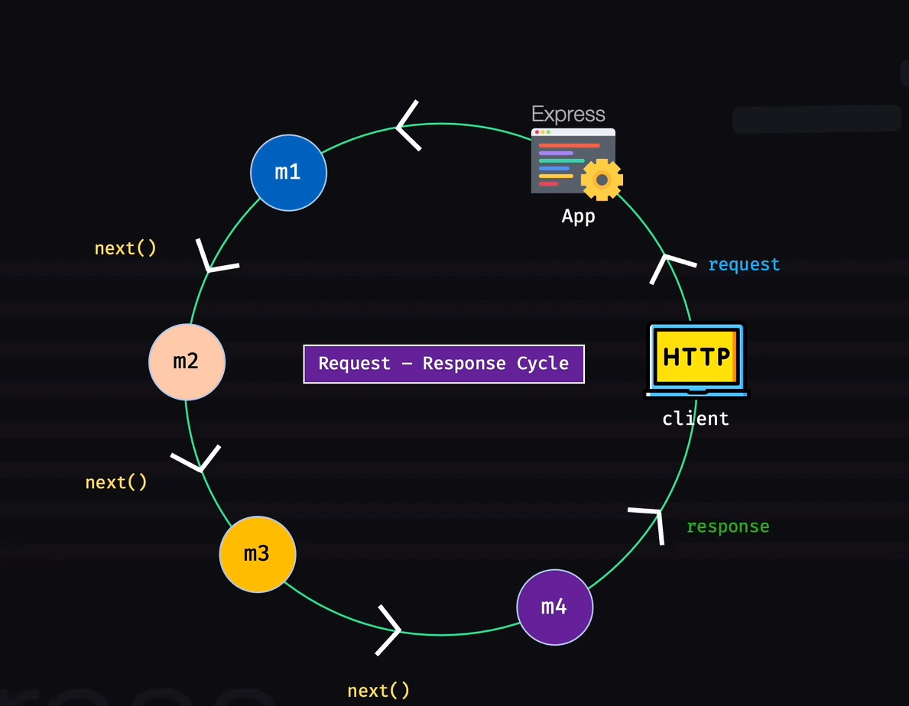
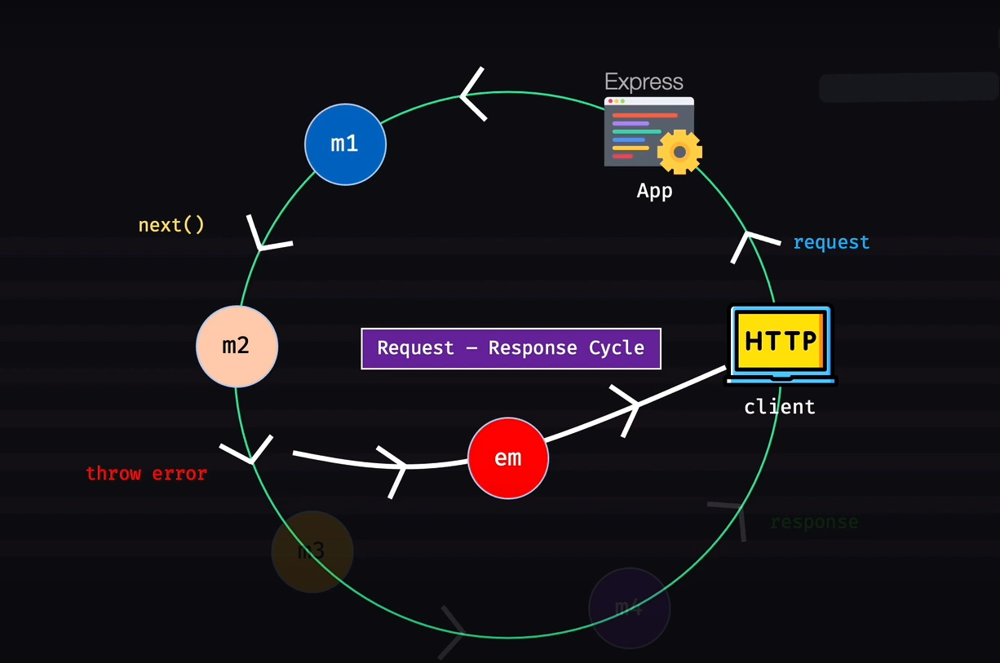
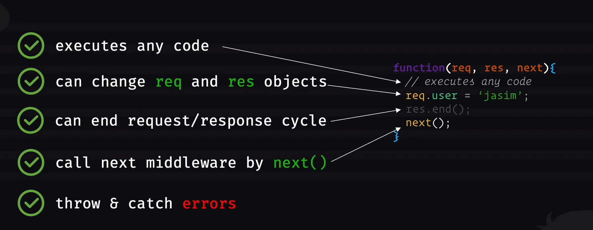
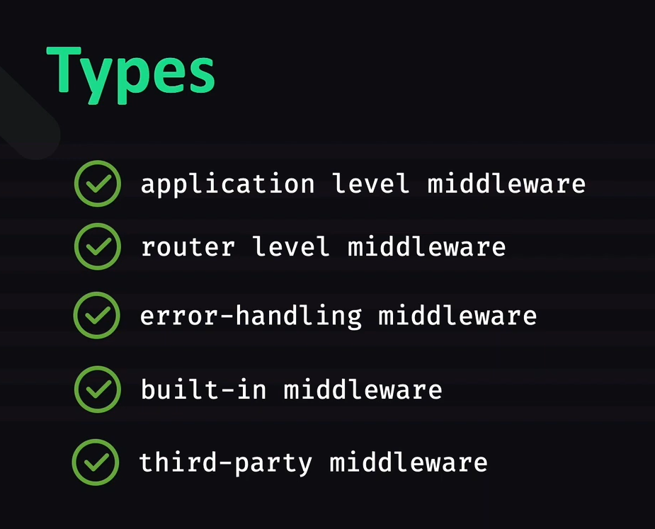

## What is Middleware?
>functions that have access to **req** and **res** object and **next** function


##  What is **request cycle** and **response cycle** ?

> * http client 'express' app a request kore and response er jonno wait kore

> * req ta 'express' app a dhukar pore express app ta chaile bivinno function er moddho diye ghurte pare

> * erokom kore bininno function a ghurar por amader http client kase response ta jaai

> * j kono middleware j kono shomoy **response** k call kore dite pare. Eta korle oi moiddleware er por porer middleware call na hoye direct 'http client' er kase response chole jabe

> * echarao j kono milldeware chaile 'error' throw korte pare... ejonno amader akta 'error handling' middleware lagbe, eita kono middleware error throw korle shetake 'catch' kore handle kore then 'http client' k response pathai dibe

> * error handling middleware na thakle program crash korte pare




## Ekta middleware ki ki korte pare sheta dekhbo.

``` js
function(req,res,next) {
    // executes any code
    req.user = 'saif'
    res.end()
    next()
}
```



## Express application a ki ki dhoroner middleware thakte pare (Types of middleware):
